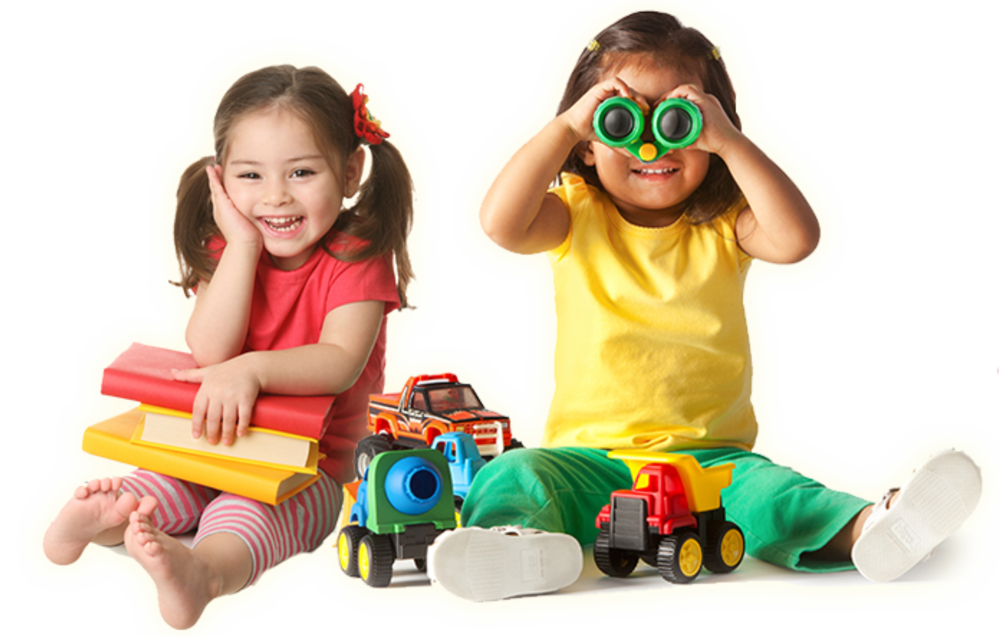

# Hero Kidzz - Project Assets


## Overview

Hero Kidzz is a small, single-vendor e-commerce web application designed for selling children's products. This repository contains all project assets including images, icons, and media files.

## Run the Codes
### CLONE
```bash
 git clone https://github.com/ferdouszihad/Hero-Kidzz-part-1.git

```
### ENV
✨ Features
Modern & clean UI
Fully responsive (mobile → desktop)
Tailwind CSS utility-first styling
DaisyUI components
React Icons integration
App Router compatible (Next.js 13+ / 14 / 15 / 16)

```

### Install
```bash
npm install
```


### Run
```bash
npm run dev
```


## DATA
<a href="src/data/toys.json">HERE is the JSON DATA</a>


## Colors

```
 /* Brand */
  --color-primary: oklch(65% 0.23 35);
  --color-secondary: oklch(58% 0.18 30);
  --color-accent: oklch(72% 0.20 55);

  /* Base */
  --color-base-100: oklch(100% 0 0);
  --color-base-200: oklch(97% 0.01 95);
  --color-base-300: oklch(92% 0.015 95);

  /* Neutral */
  --color-neutral: oklch(35% 0.01 260);
  --color-neutral-content: oklch(96% 0 0);

  /* Feedback */
  --color-success: oklch(70% 0.17 145);
  --color-error: oklch(62% 0.24 28);
```

## Getting Started

1. Clone the repository
2. Extract assets to your project directory
3. Reference images in your application

## Contributing

Follow project guidelines when adding new assets.

## License

All assets are proprietary to Hero Kidzz.
# Hero-Kidz-assets
